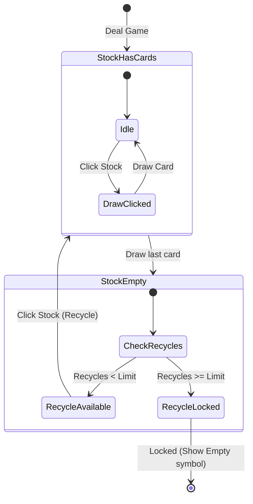

# Data Model & State Transitions: Solitaire Enhancements

This document describes the schema modifications and game state changes required to support Vegas scoring, options toggles, and performance statistics.

## 1. Entity Definitions

### GameOptions (Settings Profile)
Manages the user's board customizations and gameplay rules. Persisted in `UserDefaults`.

```swift
public struct GameOptions: Codable, Equatable {
    public var feltColor: FeltColorTheme = .feltGreen
    public var cardBackTheme: String = "Vulpera"
    public var isTimed: Bool = true
    public var isStatusBarVisible: Bool = true
    public var isSoundEnabled: Bool = true
    public var isVegasScoring: Bool = false
    public var isDrawConstraintsEnabled: Bool = false
}

public enum FeltColorTheme: String, Codable, CaseIterable {
    case feltGreen
    case crimson
    case royalBlue
    case charcoal
}
```

### GameStatistics (Lifetime Performance Records)
Tracks long-term accomplishments and streaks. Persisted in `UserDefaults`.

```swift
public struct GameStatistics: Codable, Equatable {
    public var gamesPlayed: Int = 0
    public var gamesWon: Int = 0
    public var currentStreak: Int = 0
    public var longestStreak: Int = 0
    public var totalWinningTime: Int = 0
    public var winningGamesCount: Int = 0
    
    public var winPercentage: Double {
        guard gamesPlayed > 0 else { return 0.0 }
        return (Double(gamesWon) / Double(gamesPlayed)) * 100.0
    }
    
    public var averageWinningTime: Double {
        guard winningGamesCount > 0 else { return 0.0 }
        return Double(totalWinningTime) / Double(winningGamesCount)
    }
}
```

### Stock Recycle Tracker
In `GameState` (inside `src/Models/GameState.swift`), track the remaining recycles:

```swift
public struct GameState: Codable, Equatable {
    ...
    public var remainingRecycles: Int // Computed or explicit
}
```

## 2. State & Scoring Transitions

### Scoring Modes
The game tracks and adjusts scores differently based on the scoring mode:

| Action | Standard Scoring | Vegas Scoring |
|--------|------------------|---------------|
| Start Game | `0` | `-$52` |
| Move card to Foundation | `+10` | `+$5` |
| Move card Stock/Waste to Tableau | `+5` | `+$0` |
| Move card Foundation to Tableau | `-15` | `-$5` |
| Undo last move | Revert points | Revert cash / Disallowed |

*Vegas score is represented internally as an integer (in cents, e.g. `-5200` for `-$52.00`) to prevent floating-point calculation errors.*

### Stock Pile Drawing & Recycling Transitions

The Stock Pile transition rules with Draw Constraints active:



- **Draw Three + Standard Scoring**: Limit is 3 recycles (4 total passes).
- **Draw Three + Vegas Scoring**: Limit is 1 recycle (2 total passes).
- **Draw One + Vegas Scoring**: Limit is 0 recycles (1 total pass).
